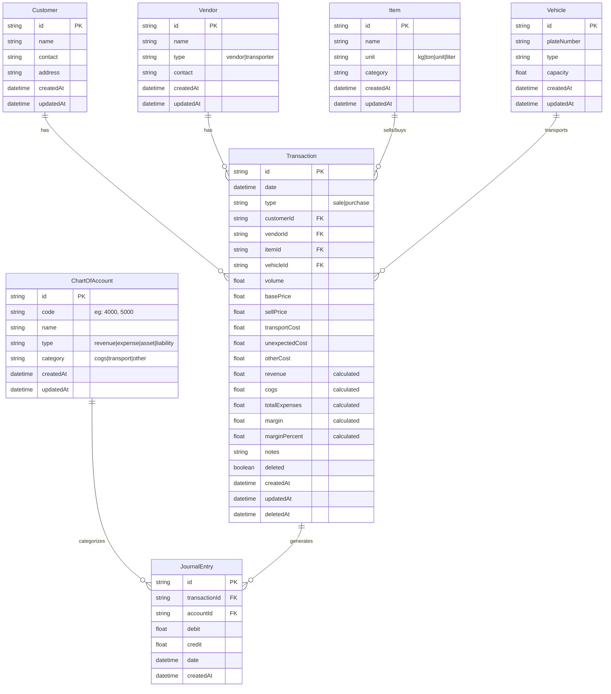

# FinTrack - Database Schema (Prisma)

## Entity Relationship Diagram



---

## Prisma Schema

```prisma
// This is your Prisma schema file,
// learn more about it in the docs: https://pris.ly/d/prisma-schema

generator client {
  provider = "prisma-client-js"
}

datasource db {
  provider = "postgresql"
  url      = env("DATABASE_URL")
}

// ============================================
// MASTER DATA MODELS
// ============================================

model Customer {
  id           String        @id @default(cuid())
  name         String
  contact      String?
  address      String?
  transactions Transaction[]
  createdAt    DateTime      @default(now())
  updatedAt    DateTime      @updatedAt

  @@index([name])
  @@map("customers")
}

model Vendor {
  id           String        @id @default(cuid())
  name         String
  type         String        // "vendor" or "transporter"
  contact      String?
  transactions Transaction[]
  createdAt    DateTime      @default(now())
  updatedAt    DateTime      @updatedAt

  @@index([name])
  @@index([type])
  @@map("vendors")
}

model Item {
  id           String        @id @default(cuid())
  name         String
  unit         String        // "kg", "ton", "unit", "liter"
  category     String?
  transactions Transaction[]
  createdAt    DateTime      @default(now())
  updatedAt    DateTime      @updatedAt

  @@index([name])
  @@map("items")
}

model Vehicle {
  id           String        @id @default(cuid())
  plateNumber  String        @unique
  type         String?
  capacity     Float?
  transactions Transaction[]
  createdAt    DateTime      @default(now())
  updatedAt    DateTime      @updatedAt

  @@map("vehicles")
}

// ============================================
// TRANSACTION MODEL
// ============================================

model Transaction {
  id             String   @id @default(cuid())
  date           DateTime
  type           String   // "sale" or "purchase"
  
  // Relations
  customerId     String?
  customer       Customer? @relation(fields: [customerId], references: [id])
  
  vendorId       String?
  vendor         Vendor?   @relation(fields: [vendorId], references: [id])
  
  itemId         String
  item           Item      @relation(fields: [itemId], references: [id])
  
  vehicleId      String?
  vehicle        Vehicle?  @relation(fields: [vehicleId], references: [id])
  
  // Transaction details
  volume         Float
  basePrice      Float     // Price per unit (COGS)
  sellPrice      Float     // Sell price per unit (Revenue)
  transportCost  Float     @default(0)
  unexpectedCost Float     @default(0)
  otherCost      Float     @default(0)
  
  // Calculated fields (stored for performance)
  revenue        Float     // sellPrice * volume
  cogs           Float     // basePrice * volume
  totalExpenses  Float     // transportCost + unexpectedCost + otherCost
  margin         Float     // revenue - cogs - totalExpenses
  marginPercent  Float     // (margin / revenue) * 100
  
  notes          String?
  deleted        Boolean   @default(false)
  
  // Journal entries for accounting
  journalEntries JournalEntry[]
  
  createdAt      DateTime  @default(now())
  updatedAt      DateTime  @updatedAt
  deletedAt      DateTime?

  @@index([date])
  @@index([type])
  @@index([customerId])
  @@index([vendorId])
  @@index([itemId])
  @@index([deleted])
  @@map("transactions")
}

// ============================================
// CHART OF ACCOUNTS (COA)
// ============================================

model ChartOfAccount {
  id             String         @id @default(cuid())
  code           String         @unique // e.g., "4000" for Revenue, "5000" for COGS
  name           String         // e.g., "Pendapatan Penjualan"
  type           String         // "revenue", "expense", "asset", "liability"
  category       String?        // "cogs", "transport", "unexpected", "other"
  journalEntries JournalEntry[]
  createdAt      DateTime       @default(now())
  updatedAt      DateTime       @updatedAt

  @@index([code])
  @@index([type])
  @@map("chart_of_accounts")
}

// ============================================
// JOURNAL ENTRIES (for accounting integrity)
// ============================================

model JournalEntry {
  id            String          @id @default(cuid())
  transactionId String
  transaction   Transaction     @relation(fields: [transactionId], references: [id], onDelete: Cascade)
  
  accountId     String
  account       ChartOfAccount  @relation(fields: [accountId], references: [id])
  
  debit         Float           @default(0)
  credit        Float           @default(0)
  date          DateTime
  
  createdAt     DateTime        @default(now())

  @@index([transactionId])
  @@index([accountId])
  @@index([date])
  @@map("journal_entries")
}
```

---

## Seed Data (COA Dasar)

```typescript
// prisma/seed.ts
import { PrismaClient } from '@prisma/client';

const prisma = new PrismaClient();

async function main() {
  // Chart of Accounts - Basic Setup
  const accounts = [
    { code: '4000', name: 'Pendapatan Penjualan', type: 'revenue', category: null },
    { code: '5000', name: 'Harga Pokok Penjualan (COGS)', type: 'expense', category: 'cogs' },
    { code: '6100', name: 'Biaya Transport', type: 'expense', category: 'transport' },
    { code: '6200', name: 'Biaya Tak Terduga', type: 'expense', category: 'unexpected' },
    { code: '6300', name: 'Biaya Lainnya', type: 'expense', category: 'other' },
  ];

  for (const account of accounts) {
    await prisma.chartOfAccount.upsert({
      where: { code: account.code },
      update: {},
      create: account,
    });
  }

  console.log('✅ Seed data berhasil!');
}

main()
  .catch((e) => {
    console.error(e);
    process.exit(1);
  })
  .finally(async () => {
    await prisma.$disconnect();
  });
```

---

## Key Design Decisions

### 1. **Calculated Fields di Transaction**
**Kenapa disimpan di database?**
- Performance: Tidak perlu calculate ulang setiap query
- Indexing: Bisa sorting/filter by margin
- Reporting: Faster aggregation untuk P&L

**Trade-off**: Harus pastikan calculation logic konsisten (gunakan Prisma middleware atau trigger).

### 2. **Soft Delete (deleted field)**
**Kenapa?**
- Audit trail: Bisa trace transaksi yang dihapus
- Undo feature: User bisa restore jika salah hapus
- Reporting integrity: Laporan historis tetap akurat

**Implementation**:
```typescript
// Semua query harus filter deleted = false by default
const transactions = await prisma.transaction.findMany({
  where: { deleted: false }
});
```

### 3. **Journal Entry (Double-Entry Bookkeeping)**
**Mandatory untuk MVP?** → **OPTIONAL**

**Pros jika pakai**:
- Accounting integrity (debit = credit)
- Audit trail yang kuat
- Mudah expand ke General Ledger nanti

**Cons**:
- Kompleksitas lebih tinggi
- Perlu validasi debit/credit balance

**Rekomendasi untuk MVP**: 
- Buat tabelnya tapi **jangan generate journal entry dulu**
- Cukup hitung dari Transaction langsung
- Nanti bisa diaktifkan di versi 2.0

### 4. **Customer vs Vendor di Transaction**
**Kenapa ada customerId DAN vendorId?**
- Sale transaction → pakai customerId
- Purchase transaction → pakai vendorId
- Satu transaksi **hanya bisa salah satu**, enforced di API level

### 5. **Index Strategy**
**Critical indexes untuk performance**:
```sql
-- Query frequent fields
transactions(date)           -- Filter by date range
transactions(type)           -- Filter sale/purchase
transactions(customerId)     -- Customer transactions
transactions(deleted)        -- Active transactions only

-- Composite index untuk reporting query
CREATE INDEX idx_transactions_date_deleted 
ON transactions(date, deleted);
```

---

## Migration Commands

```bash
# Generate migration
npx prisma migrate dev --name init

# Apply migration to production
npx prisma migrate deploy

# Generate Prisma Client
npx prisma generate

# Seed database
npx prisma db seed
```

---

## Sample Queries

### Create Transaction with Auto-Calculation
```typescript
const transaction = await prisma.transaction.create({
  data: {
    date: new Date(),
    type: 'sale',
    customerId: 'customer-id-123',
    itemId: 'item-id-456',
    volume: 10,
    basePrice: 5000,
    sellPrice: 7000,
    transportCost: 500,
    unexpectedCost: 200,
    otherCost: 0,
    // Calculated fields
    revenue: 10 * 7000,        // 70,000
    cogs: 10 * 5000,           // 50,000
    totalExpenses: 500 + 200,  // 700
    margin: 70000 - 50000 - 700, // 19,300
    marginPercent: (19300 / 70000) * 100 // 27.57%
  },
  include: {
    customer: true,
    item: true
  }
});
```

### Get P&L Data for Period
```typescript
const plData = await prisma.transaction.aggregate({
  where: {
    date: {
      gte: startDate,
      lte: endDate
    },
    deleted: false
  },
  _sum: {
    revenue: true,
    cogs: true,
    transportCost: true,
    unexpectedCost: true,
    otherCost: true,
    margin: true
  },
  _count: true
});
```

### Top 3 Customers by Revenue
```typescript
const topCustomers = await prisma.transaction.groupBy({
  by: ['customerId'],
  where: {
    type: 'sale',
    deleted: false,
    date: { gte: startDate, lte: endDate }
  },
  _sum: { revenue: true },
  orderBy: { _sum: { revenue: 'desc' } },
  take: 3
});
```
